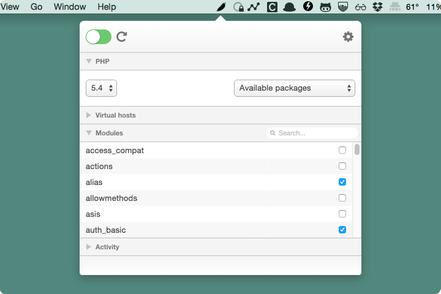

An Apache GUI for OSX.

---

* [Download](#download)
* [Features](#features)
* [Development installation](#development-installation)
* [Changelog](#changelog)
* [License](#license)
* [Credits](#credits)

## Download

### [Download v1.0.0](https://github.com/johansatge/pawnee/releases/download/v1.0.0/pawnee-1.0.0.zip)

*34Mb - Requires Mac OS 10.10*

## Features

Pawnee is a menubar utility designed to help you manage your local Apache installation.

Features are organised in panels:

| Panel | Description |
| --- | --- |
| PHP | Detects installed PHP versions (with [Homebrew](http://brew.sh/)) for easy switch |
| Virtual hosts | View and edit configured virtual hosts |
| Modules | Displays available and enabled Apache modules |
| Activity | Shows server activity for easy debug |

The application works with the `/private/etc/apache2/httpd.conf` file.

* When this file is updated, the server will restart automatically
* When editing the file for the first time, a backup will be made (`/private/etc/apache2/httpd.pawnee-backup.conf`)

## Development installation

If you want to contribute, you should follow those steps to get started.

### Installation steps

**1.** Install [node.js](https://nodejs.org/) and [npm](https://github.com/npm/npm) if needed

**2.** Install [NW.js](http://nwjs.io/) in `/Applications` if needed

**3.** Install [Grunt](http://gruntjs.com/) if needed

**4.** Get the project and its dependencies

```bash
git clone https://github.com/johansatge/pawnee.git
npm install
cd pawnee/app && npm install
```

### Development

Run the application:

```bash
grunt run
```

Build the application:

```bash
grunt build
```

Watch SASS files:

```bash
grunt sass
```

## Changelog

| Version | Date | Notes |
| --- | --- | --- |
| `1.0.0` | February 12th, 2015 | Initial version |

## License

This project is released under the [MIT License](LICENSE).

## Credits

* [NW.js](http://nwjs.io)
* [node-webkit-builder](https://github.com/mllrsohn/node-webkit-builder)
* [jQuery](http://jquery.com/)
* [Font Awesome](http://fortawesome.github.io/Font-Awesome/)
* [Brew](http://brew.sh/)
* [Grunt](http://gruntjs.com/)
